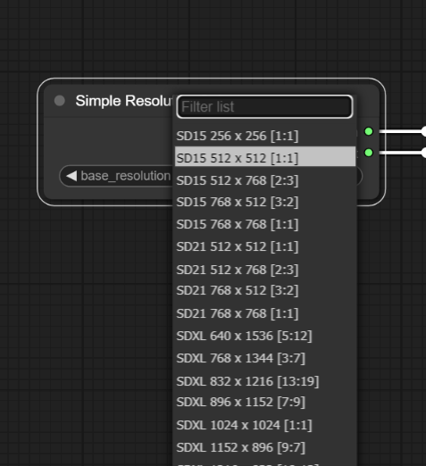

# Simple Resolution Selector for ComfyUI

A custom node for Stable Diffusion [ComfyUI](https://github.com/comfyanonymous/ComfyUI) to enable easy selection of image resolutions for SDXL SD15 SD21.
Forked from the [ComfyUI Resolution Selector](https://github.com/bradsec/ComfyUI_ResolutionSelector/) by Mark Bradley

- Select base resolution, width and height are returned as `INT` values which can be connected to latent image inputs or other inputs such as the `CLIPTextEncodeSDXL` `width, height, target_width, target_height`.
- Resolution list is filterable on base model (SDXL, SD15 for SD 1.5, SD21 for SD 2.1) and aspect ratio

```terminal
# Example
SDXL 1024 x 1024 [1:1]
SD21 512 x 768 [2:3]
SD15 768 x 512 [3:2]
```

### Installation

```
# Change to the directory you installed ComfyUI
cd pathTo/ComfyUI

# Change to the custom_nodes directory ie.
cd custom_nodes
```

```terminal
# Clone the repo into custom_nodes
git clone https://github.com/Jantolick/ComfyUI_SelectResolution.git

# Restart ComfyUI
```

### Usage after install

`Add Node > utils > Simple Resolution Selector`


